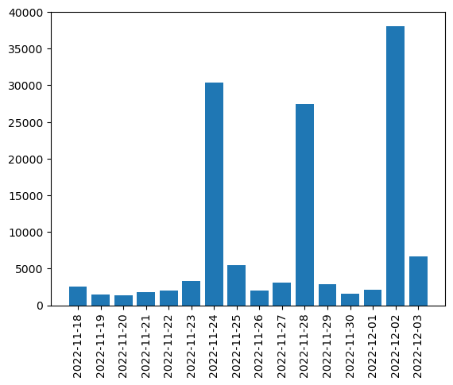

# Tweets Dataset on the Ghanaian 26-man squad and backroom staff members for the 2022 FIFA world cup.

This repository contains IDs of tweets that were sent to the twitter account of the selected Ghanaian 26-man squad and backroom staff members during the FIFA world 2022 at Qatar. We are sharing only tweet ID's in order to comply with the [Terms and Conditions of Twitter](https://developer.twitter.com/en/developer-terms/agreement-and-policy) regarding the sharing of tweets.

# Data Organization
* On November 18, 2022, we began our dataset collection with the Twitter streaming API and a python library, Tweepy.
*	Tweet-ID files are group into four files, which is the 26 players, backroom staff members, GFA, and the national team [Number of Tweets](images/figure1.png).

# Dataset collection
* Tweets were collected from November 18th to December 3rd 2022.
* The tweets were collected using the official Twitter account names of the players, their known names or nicknames and other hashtags.The Account name and searched keywords folder contains a list of the 26-man squad, number of tweets and their keywords used in generating the tweets.
* Tweets can be fully collected using the following tools [Hydrator](https://github.com/DocNow/hydrator)  and [twarc](https://github.com/DocNow/twarc) or [Tweepy](https://www.tweepy.org/).

# Dataset Statistics
The following are the collective summary if the dataset 
Statistics	Frequency 
Number of Tweets:	132,115 
Number of duplicate tweets:	13,625 
Number of Unique tweets:	118,490 
Number of Retweets:	22,448 
Average number of tweets per day:	8,260  
Average number of tweets per player:	2520 
Tweets with location:	91,256

* [Dataset wordcloud](images/wordcloud.png)

# Guideline to Hydrate or use Tweepy
 ### Using Twarc to hydrate ### 
To hydrate the tweets-ID from our [Ghana-FIFA2022-WorldCup-Dataset](https://github.com/meshun074/Ghana-FIFA2022-WorldCup-Dataset) use the file  [Twarc](https://github.com/meshun074/Ghana-FIFA2022-WorldCup-Dataset/blob/main/Guildlines_to_retrieve_tweets/twarc.ipynb) notebook.

 ### Using Tweepy in a Notebook ### 
 To use tweepy library to retrieve tweets using tweets-ID from our [Ghana-FIFA2022-WorldCup-Dataset](https://github.com/meshun074/Ghana-FIFA2022-WorldCup-Dataset) use the file  [Tweepy](https://github.com/meshun074/Ghana-FIFA2022-WorldCup-Dataset/blob/main/Guildlines_to_retrieve_tweets/Tweepy.ipynb) notebook.
 
 * Note you are required to have a Twitter developer account

# Acknowledgement
* This work was made possible by Dr. Rose-Mary Gyening, Dr. Kate Takyi and  Sarah Alqurashi
 
